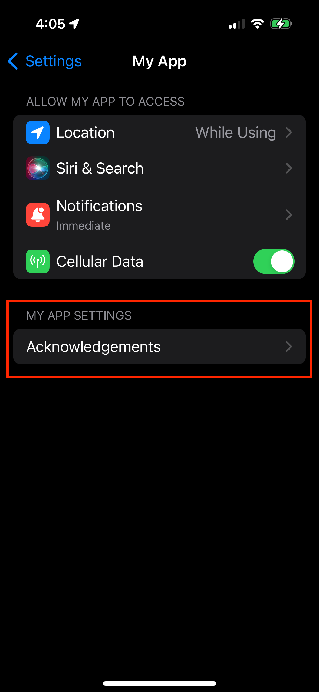
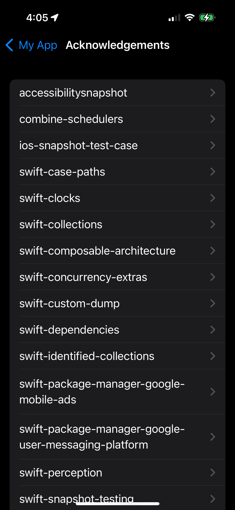
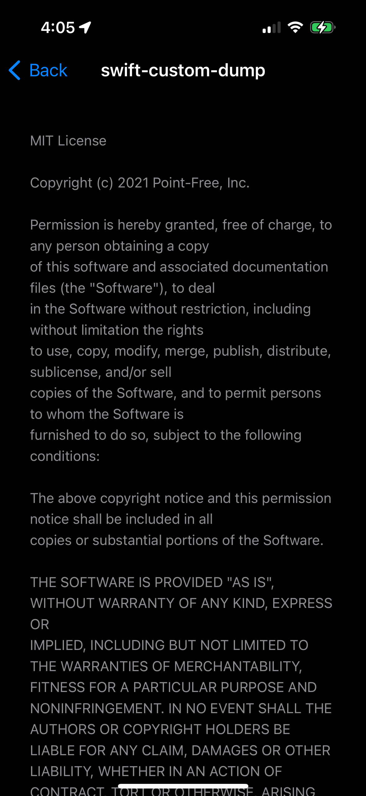

# SwiftPM Settings Acknowledgements

Generate a license acknowledgements page for your app from your SwiftPM dependencies.

| App Settings |  Acknowledgements | License Details |
| ---| --- | --- |
|  |  |  |

## Installation

Currently the only supported installation method is cloning and installing. The command will be added to `/usr/bin/local`.

```shell
git clone https://github.com/natesabrown/swiftpm-settings-acknowledgements
cd swiftpm-settings-acknowledgements
sudo make install
```

## Usage

In your app's root directory, run:

```shell
swiftpm-settings-acknowledgements
```

Drag the resulting `Settings.bundle` into your `.xcodeproj`.

## Options

#### `--directory-path`, `-d`
**(Option)** Path to the directory containing the `.xcodeproj`.

If not provided, this program will look for the first `.xcodeproj` in the directory. 

**Default**: `nil`.
#### `--github-token`
**(Option)** Add a GitHub token to help prevent rate limiting when fetching license information from GitHub.

If no `--package-cache-path` is specified, this package will look to GitHub to get license information. To guard against rate limits from their API, you can provide an access token. For guidance, see [generating a personal access token (GitHub)](https://docs.github.com/en/authentication/keeping-your-account-and-data-secure/managing-your-personal-access-tokens).

**Default**: `nil`.
#### `--languages`, `-l`
**(Option)** Specify the languages to localize the "Acknowledgements" text for. If multiple, separate by commas (e.g. "en,es,ja").

Available languages:
* `en`: English
* `es`: Spanish
* `fr`: French
* `kn`: Kannada
* `ja`: Japanese
* `zh_Hans`: Chinese, Simplified

**Default**: `en`.
#### `--output-path`, `-o`
**(Option)** Where the `Settings.bundle` should end up.

If not provided, the bundle will be created in the current directory.

**Default**: `nil`.
#### `--package-cache-path`
**(Option)** Provide a custom path to your `Package.resolved` file.

If provided, this program will look through the package directory for licenses instead of contacting the GitHub API.

To find the package cache for your project, option-click on a package listed in "Package Dependencies" in Xcode and select "Show in Finder".

**Default**: `nil`.
#### `--package-resolved-path`
**(Option)** Provide a custom path to your `Package.resolved` file.

If not provided, this program will look for the file within your directory's `.xcworkspace`.

**Default**: `nil`.
#### `--verbose`, `-v`
**(Flag)** Print extra details during program execution.

**Default**: disabled.

## Acknowledgements

This project was inspired by [LicensePlist](https://github.com/mono0926/LicensePlist) by [mono0926](https://github.com/mono0926).

<!-- Fix table image sizing -->
<style>
    table th {
        width: 33.33%;
    }
</style>